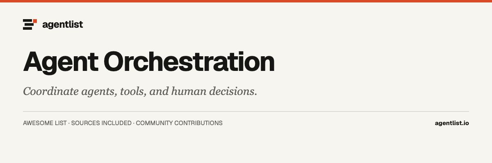

  

# Awesome Agent Orchestration

  

> Frameworks and visual tools for agent coordination, durable workflows, and human approvals.

46 projects · Upstream documentation checked 2026-09-30–2026-10-02. Curated by [agentlist.io](https://www.agentlist.io).

**Move from one agent to coordinated work.**

Start with the coordination problem: separate independent tasks, pass work between specialists, or keep a long-running workflow recoverable. Adding agents also adds state, handoffs, and failure cases. Choose the smallest coordination model that makes those responsibilities clear.

Tools that compose agent steps, delegate work, or manage multi-agent workflows. Coding-agent clients and model-routing gateways are separate categories. Frameworks require application code; visual builders provide an authoring interface.

## Contents

- [How to choose](#how-to-choose)
- [Decision table](#decision-table)
- [Code-first frameworks](#code-first-frameworks)
- [Visual workflow builders](#visual-workflow-builders)
- [Control planes for existing agents](#control-planes-for-existing-agents)
- [Maintenance, archived, and historical references](#maintenance-archived-and-historical-references)
- [Related awesome lists](#related-awesome-lists)
- [More from Agentlist](#more-from-agentlist)
- [Contributing](#contributing)

## How to choose

- Works with: Can it use your agents and tools directly, or does it require rewriting them in its own framework?
- Runs where: Who operates the workers, queues, scheduler, and persistent state? Which parts require a hosted service?
- Needs access to: How are tools, credentials, and workspaces assigned to individual agents? Can concurrent workers change the same files?
- Keeps what: Are task state, decisions, artifacts, and handoffs durable? Can failed work resume without repeating completed actions?
- Human involvement: Where can you approve a plan, redirect a worker, inspect a diff, or stop the whole workflow?
- Main limitation: How does it handle conflicting edits, failed handoffs, retries, and duplicate work? Distinguish documented guarantees from examples.

Use these questions with the decision table. Every entry summarizes its linked documentation. These lists were not install-tested, so entries do not repeat that. A capability the linked page does not state is unknown.

## Decision table

Start with your requirement. These examples highlight documented differences; they are not rankings.

| When you need | Documented fit | Key distinction | Unresolved | Source |
| --- | --- | --- | --- | --- |
| Rewrite agents in a framework, or drive a harness you already run? | LangGraph and MetaGPT are code-first. Paperclip and GitHub Agentic Workflows drive existing agents. | Paperclip uses agents such as Claude Code and Codex and is a control plane for them, not a new model loop. LangGraph and MetaGPT are frameworks where you define the agents. | Unknown whether LangGraph or MetaGPT can supervise an unmodified Claude Code install. Their READMEs define the agents in the framework. | [LangGraph](https://github.com/langchain-ai/langgraph#readme), [MetaGPT](https://github.com/FoundationAgents/MetaGPT#readme), [Paperclip](https://github.com/paperclipai/paperclip#readme), [GitHub Agentic Workflows](https://github.com/github/gh-aw#readme) |
| Call a library in your process, or operate a visual builder? | smolagents and LangGraph are in-process libraries. n8n is a visual builder with Docker and a cloud editor. | n8n combines a visual canvas with code and runs self-hosted or in the cloud, with human approvals listed as a capability. smolagents is a Python library you import, not that canvas. | Unknown which n8n templates require the cloud editor rather than the Docker install. The n8n README shows both. | [smolagents](https://github.com/huggingface/smolagents#readme), [LangGraph](https://github.com/langchain-ai/langgraph#readme), [n8n](https://github.com/n8n-io/n8n#readme) |
| Redistribute n8n inside a product we charge for? | n8n under the Sustainable Use License. Activepieces is a separate MIT-plus-enterprise split. | LICENSE.md allows use only for your own internal business purposes, or non-commercial or personal use, and distribution only free of charge for non-commercial purposes. .ee files need an Enterprise license. | Unknown which shipped nodes are .ee code. The license puts those files outside the Sustainable Use License. | [n8n](https://raw.githubusercontent.com/n8n-io/n8n/master/LICENSE.md), [Activepieces](https://raw.githubusercontent.com/activepieces/activepieces/main/LICENSE) |
| Host Dify as a multi-tenant service for other customers? | Dify. n8n is limited by the Sustainable Use License, not by this workspace clause. | Dify's modified Apache-2.0 license says you may not use the source to operate a multi-tenant environment unless Dify authorizes it in writing. It defines one tenant as one workspace. | Unknown whether a specific host already has that written authorization. Removing the console logo also needs authorization. | [Dify](https://raw.githubusercontent.com/langgenius/dify/main/LICENSE), [n8n](https://raw.githubusercontent.com/n8n-io/n8n/master/LICENSE.md) |
| Start a new Microsoft project on AutoGen? | AutoGen is in maintenance mode. Microsoft Agent Framework is the README's destination for new users. | AutoGen will not receive new features and is community managed. Its legal notice puts documentation under CC-BY-4.0 and code under the MIT License in LICENSE-CODE. | Unknown how long community maintainers will ship fixes. Contributions are limited to bug fixes, security patches, and documentation. | [AutoGen](https://github.com/microsoft/autogen#readme), [Microsoft Agent Framework](https://github.com/microsoft/agent-framework#readme) |
| Start new work in Semantic Kernel rather than its successor? | Semantic Kernel's banner points to Microsoft Agent Framework. AutoGen's README points there too. | The banner says Semantic Kernel is now Microsoft Agent Framework. The same README still documents agents, plugins, and a process model, and says the code is under the MIT license. | Unknown whether the Python, .NET, and Java packages still accept features. The banner tells new users to start on Microsoft Agent Framework. | [Semantic Kernel](https://github.com/microsoft/semantic-kernel#readme), [Microsoft Agent Framework](https://github.com/microsoft/agent-framework#readme), [AutoGen](https://github.com/microsoft/autogen#readme) |
| Use OpenAI Swarm as a maintained multi-agent product? | Swarm is historical. OpenAI Agents SDK is the replacement the Swarm README names. Not Swarms or Agency Swarm. | Swarm is experimental and educational, replaced by the OpenAI Agents SDK, and a run stores no state between calls unless you pass the earlier messages back in. | Unknown which educational examples still match today's Agents SDK. Migrate for maintained use. | [Swarm](https://github.com/openai/swarm#readme), [OpenAI Agents SDK](https://github.com/openai/openai-agents-python#readme), [Swarms](https://github.com/kyegomez/swarms#readme), [Agency Swarm](https://github.com/VRSEN/agency-swarm#readme) |
| Pause a run so a person can inspect or approve it? | LangGraph and mcp-agent document a human stop. MetaGPT's quickstart and Rivet's README do not. | LangGraph lets a person inspect and modify agent state during execution. mcp-agent shows a human-input signal. MetaGPT's usage example writes ./workspace with no approval step. | Unknown whether MetaGPT or Rivet can pause before a write. Those README pages do not show an approval stop. | [LangGraph](https://github.com/langchain-ai/langgraph#readme), [mcp-agent](https://github.com/lastmile-ai/mcp-agent#readme), [MetaGPT](https://github.com/FoundationAgents/MetaGPT#readme), [Rivet](https://github.com/Ironclad/rivet#readme) |
| Let the agent job write to the GitHub repo itself? | GitHub Agentic Workflows. Paperclip is another control plane and does not use this Actions split. | Agent jobs are read-only and sandboxed by default, and configured writes go through separate safe-outputs jobs. Those controls are configurable. | Unknown how a given workflow changed the defaults. Runs can still go wrong, so authors must review permissions. | [GitHub Agentic Workflows](https://github.com/github/gh-aw#readme), [Paperclip](https://github.com/paperclipai/paperclip#readme) |
| Treat all of Activepieces as MIT? | Activepieces. n8n's non-enterprise code is Sustainable Use, not this MIT split. | The LICENSE grants MIT for content outside packages/ee and packages/server/api/src/app/ee. Those enterprise paths use the separate license in packages/ee/LICENSE. | Unknown what packages/ee/LICENSE permits. This page names that file and does not include its terms. | [Activepieces](https://raw.githubusercontent.com/activepieces/activepieces/main/LICENSE), [n8n](https://raw.githubusercontent.com/n8n-io/n8n/master/LICENSE.md) |

## Code-first frameworks

- [Agno](https://github.com/agno-agi/agno) - Python framework and AgentOS runtime for agents, teams, and workflows. Define agents in the SDK, serve an API, and manage runs in the AgentOS UI. Docker starters store sessions, memory, and traces in a database you operate. Runs can pause for confirmation and block tools needing approval. Telemetry per run, unless AGNO_TELEMETRY is false, omits prompts and outputs. **Python framework.**
- [CrewAI](https://github.com/crewAIInc/crewAI) - Python framework for role-based crews and event-driven flows, running in your process against the model provider you configure. Agents and tasks can be declared in JSON or Python, with human input during a run and checkpointing. CrewAI AMP is a separate commercial control plane, not part of the open-source process. Conflicting edits to the same files have no described resolution. **Python framework.**
- [Google ADK](https://github.com/google/adk-python) - Code-first Python toolkit for agents and graph workflows, with a tool-confirmation step before a guarded tool runs. Optimized for Gemini, not tied to one model. adk web is a local dev UI; Cloud Run and Vertex AI Agent Engine are deploy targets. google/adk-go and google/adk-js are sibling kits, not separate rows. No export format beyond the deployed app is documented. **Python SDK.**
- [LangGraph](https://github.com/langchain-ai/langgraph) - Low-level Python library for long-running stateful workflows, usable without LangChain. LangGraph.js is the JavaScript library and is not a separate row. A persisted run resumes after a failure, and a person can inspect and edit state at an interrupt. LangSmith is a separate tracing and deployment product. How two workers merge conflicting file edits is not specified. **Python library.**
- [Mastra](https://github.com/mastra-ai/mastra) - TypeScript framework for agents and graph workflows you embed in a Node app or run as its own server, with a local Studio UI. Storage keeps a suspended run so a person can approve or supply input before it resumes. Model calls use the provider credentials you configure. Defining or running a workflow does not require a hosted Mastra service. **TypeScript framework.**
- [Microsoft Agent Framework](https://github.com/microsoft/agent-framework) - Python and .NET framework for agents and graph workflows, including sequential, concurrent, handoff, and group patterns, with checkpointing and human-in-the-loop control. The Go SDK, microsoft/agent-framework-go, is not a third row. Samples show Microsoft Foundry and other providers inside an app you run. AutoGen and Semantic Kernel direct new users here and are no longer the starting point. **Python and .NET.**
- [OpenAI Agents SDK](https://github.com/openai/openai-agents-python) - Python SDK for agents, tools, guardrails, sessions, and handoffs. The JavaScript library is openai/openai-agents-js and is not a separate row. Runs execute in your process, with optional sandbox agents, an optional Redis extra for sessions, and documented human-in-the-loop checks. The SDK can call OpenAI APIs or many other chat models. It is not a visual builder. **Python SDK.**
- [Pydantic AI](https://github.com/pydantic/pydantic-ai) - Typed Python agent loop for tools and structured output, from a script, a terminal, or a voice session. Human-in-the-loop tool approval is documented, and optional durable execution, including Temporal, can replay model and tool calls after a restart. Pydantic Graph and Pydantic Evals are separate packages. Logfire and the model gateway are optional and not required for a local run. **Python framework.**
- [smolagents](https://github.com/huggingface/smolagents) - Python library whose CodeAgent writes actions as Python code, beside a ToolCallingAgent for ordinary tool calls, with multi-agent hierarchies. Code can run in Blaxel, E2B, Modal, or Docker. LocalPythonExecutor is not a security sandbox. You pick the model: local transformers, Ollama, or a hosted API. Hugging Face Hub push is documented. No human approval is required before code runs. **Python library.**
- [CAMEL](https://github.com/camel-ai/camel) - Python research framework for multi-agent role play, agent societies, and tool-using chat agents. The quickstart runs in your process with a model API key and keeps agent memory across steps. A linked cookbook covers human oversight and tool approval. Orchestration is one research use, alongside data generation and simulated environments, and the ChatAgent quickstart does not document a durable checkpoint store. **Python framework.**
- [AG2](https://github.com/ag2ai/ag2) - Python framework under Apache-2.0 for agents cooperating over a Network of a hub, typed channels, and a write-ahead log. A person can pause to confirm or supply missing information. AG2 v1 is not the classic autogen import; that code is ag2ai/ag2-classic, which remains maintained. AG2 continues AutoGen's ideas in the community and does not replace Microsoft Agent Framework. **Python framework.**
- [Haystack](https://github.com/deepset-ai/haystack) - Python framework for retrieval pipelines and, separately, agent workflows. Orchestration is one use, not the whole project, which also centers retrieval, routing, memory, and generation for search and RAG. Components run in your process, and Hayhooks exposes a pipeline over HTTP or MCP. A required human approval step is not described, and you bring the model and the document stores. **Python framework.**
- [Swarms](https://github.com/kyegomez/swarms) - Python library for composing agents into sequential, concurrent, hierarchical, and group-chat workflows. An agent is a model plus tools and memory, runs in your Python process, can call MCP servers by URL, and uses WORKSPACE_DIR as the documented workspace path. The first-agent example does not describe a required human approval gate, and no merge rule is given for conflicting edits across agents. **Python framework.**
- [Agency Swarm](https://github.com/VRSEN/agency-swarm) - Python framework that builds multi-agent agencies on top of the OpenAI Agents SDK, with roles, tools, and communication only along flows you declare through a send_message tool. Other model vendors can be reached through LiteLLM, and you persist threads with load and save callbacks. A person-approval step is not documented, and this layer does not replace the Agents SDK. **Python framework.**
- [VoltAgent](https://github.com/VoltAgent/voltagent) - TypeScript framework for typed agents, tools, MCP, and declarative multi-step workflows. The expense example suspends until a person submits a decision, then resumes. Memory can use an adapter such as local LibSQL. The dev server links to the VoltOps console, a separate cloud or self-hosted observability and deploy surface, not required to define the agent in code. **TypeScript framework.**
- [AX](https://github.com/google/ax) - Kubernetes orchestrator for agent tasks, not a library you import. Apply Task and Workspace manifests. Agent Substrate sandboxes each task with CPU and memory limits. ax suspend and ax resume pause and continue an idle task. Needs a cluster with Substrate and the gRPC CLI. The API may break before a stable release. ax ssh looks inside a running sandbox. **Kubernetes orchestrator.**
- [Strands Agents](https://github.com/strands-agents/harness-sdk) - Python and TypeScript SDK for an agent loop in your process, with no hosted control plane. A harness package builds a preassembled agent. The lower-level SDK attaches tools, providers, sessions, hooks, MCP, and multi-agent patterns for Amazon Bedrock, Anthropic, OpenAI, and Gemini. Hooks can intercept a step. A separate approval service is not required. **Python and TypeScript.**
- [MetaGPT](https://github.com/FoundationAgents/MetaGPT) - Python framework that turns a one-line requirement into a software workspace by walking role steps such as product, architecture, and engineering, writing a repository under ./workspace from model settings in ~/.metagpt/config2.yaml. That quickstart does not document a human approval stop before the write. **Python framework.**
- [PraisonAI](https://github.com/MervinPraison/PraisonAI) - Python library for agents, handoffs, and AgentFlow graphs with route, parallel, and repeat steps. An approval flag is a human gate before a risky tool runs. Memory persists when you pass a user id. Execution can use a shared Docker sandbox or a hosted agent runtime instead of your machine. How two agents merge conflicting edits is not documented. **Python framework.**
- [Claude Agent SDK](https://github.com/anthropics/claude-agent-sdk-python) - Python SDK for Claude Code's agent loop, not a multi-vendor orchestrator. The Claude Code CLI is bundled by default, or you point at another path. Permissions stay with Claude Code: allowed_tools auto-approves listed tools and leaves the rest, which follow permission_mode or a can_use_tool callback. Custom tools are in-process MCP servers. It does not switch among unrelated agent products. **Python SDK.**
- [Agent Squad](https://github.com/2FastLabs/agent-squad) - Routes each user turn to one registered agent, with Python, TypeScript, and on-device Swift. A classifier uses descriptions and history, stores the exchange, and a supervisor can call other agents as tools. Python and TypeScript run on a laptop, in containers, or on Lambda; Swift stays on Apple devices. Moved from awslabs/agent-squad. No human approval step on the basic route. **Multi-runtime library.**
- [Griptape](https://github.com/griptape-ai/griptape) - Python framework for a single-task agent, a task pipeline, or parallel tasks. Swappable drivers change the model provider without rewriting the graph. Conversation memory differs from task memory, which keeps large outputs off the prompt. Runs stay in your Python process. Griptape Nodes is a separate visual desktop app, not its own row. No required human approval step is described. **Python framework.**
- [mcp-agent](https://github.com/lastmile-ai/mcp-agent) - Python framework connecting agents to Model Context Protocol servers and a few workflow patterns. The same agent code runs on asyncio or Temporal and can pause and resume without an API change. Human input is a workflow signal. The resume command is the cloud workflows path, not the asyncio quickstart. API keys go in a secrets file or the environment. **Python framework.**
- [ChatDev](https://github.com/OpenBMB/ChatDev) - ChatDev 2.0, called DevAll, is a multi-agent platform: a visual canvas and a Python package for YAML workflows. Define agents and flows in configuration, launch from the local FastAPI and Vue UI or from code. Human feedback is available while a run is open, and files land under WareHouse. Older virtual-software-company mode stays on branch chatdev1.0, not the default. **Workflow platform.**
- [uAgents](https://github.com/fetchai/uAgents) - Python library for agents messaging each other on the Fetch.ai network. Each named agent registers on the Almanac smart contract at startup, keeps a private key in a local file when no seed is passed, and can run scheduled tasks or handle incoming messages. No human approval step, and no offline mode that skips Almanac registration. **Python library.**
- [LightAgent](https://github.com/wanxingai/LightAgent) - Python framework for one tool-using agent, LightSwarm delegation, and LightFlow graphs. LightFlow is a DAG with retries, checkpoints, resume, and approval nodes. A human-approval hook covers selected tools and handoffs, and calls use OpenAI-compatible endpoints with MCP over stdio and SSE. Durable sessions are optional. Arbitrary Python execution is opt-in and needs an explicit sandbox boundary. **Python framework.**
- [Zeroshot](https://github.com/the-open-engine/zeroshot) - Native program turning software goals into a fixed graph: one worker implements, reviewers check, failures return to bounded repair. The graph, not a runtime agent, chooses the next step. Events go to a SQLite ledger. Local runs reuse a Codex or Claude Code login. Branch or pull-request delivery is optional. A separate human gate is not documented as required locally. **Native graph runner.**
- [Astron Agent](https://github.com/iflytek/astron-agent) - Self-hosted platform for agent workflows, model access, MCP tools, and RPA steps, not a library you import. Quick start is Docker Compose; Helm is the other install. A hosted console is at agent.xfyun.cn, so execution is services you deploy. No human approval step is documented. Exporting a workflow as a standalone function call is not described. **Workflow platform.**
- [Octop](https://github.com/TencentCloud/Octop) - Self-hosted Python assistant for several people: web dashboard, CLI, and chat gateways in one process. Switch specialist experts per task. AgentTeams is a beta multi-step coordinator. Tool approval is documented before some actions. Control-plane data defaults to SQLite under ~/.octop/. Outbound ACP can delegate to OpenCode, Claude Code, or Codex, optional runners rather than the dashboard. **Self-hosted assistant.**

## Visual workflow builders

- [Langflow](https://github.com/langflow-ai/langflow) - Visual builder for agent and retrieval flows: a Python server and desktop app for Windows and macOS. The local server listens on 127.0.0.1 port 7860; Docker is another path. A flow can be an API, a JSON export, or an MCP server. The playground steps through a draft while editing. No durable human-approval record apart from that playground is documented. **Visual builder.**
- [n8n](https://github.com/n8n-io/n8n) - Visual canvas you run with Docker or the hosted editor. An agent step is one node type, and human approval inside a workflow is documented. Sustainable Use License on non-.ee code: own internal business purposes, or non-commercial or personal use; distribution only free of charge for non-commercial purposes. .ee files need an n8n Enterprise license. Not an OSI license. **Visual automation.**
- [Activepieces](https://github.com/activepieces/activepieces) - Visual builder that assembles automations from TypeScript pieces, including AI steps and pieces that delay a run or ask a person to approve. A self-hosted deploy path is described, and contributed pieces can also be exposed as MCP servers. Content outside packages/ee and packages/server/api/src/app/ee is MIT. Those enterprise paths have their own license, so the whole repository is not MIT. **Visual builder.**
- [Rivet](https://github.com/Ironclad/rivet) - Desktop app for authoring prompt graphs, plus Rivet Core, a TypeScript library that runs those graphs in your program. Binaries cover macOS, Linux, and Windows. Integrations are a fixed set: specific OpenAI and Anthropic chat models, OpenAI embeddings, and Pinecone, not an open registry of existing agents. No human approval step or durable run log is described. **Desktop and library.**
- [Sim](https://github.com/simstudioai/sim) - Workspace for agent workflows on a canvas, in conversation, or in code. Cloud app at sim.ai, self-hosted Docker Compose via npx sim-setup, and a macOS desktop app that can point at that deployment. Runs, logs, and schedules show in the browser workspace. No human approval step is documented. Optional code execution is a setup add-on named isolated-vm. **Visual builder.**
- [Dify](https://github.com/langgenius/dify) - Visual workspace for agent workflows, retrieval pipelines, and model settings, in the cloud or via self-hosted Docker Compose that opens a local install page. Agents can run commands in their own sandbox, and APIs call Dify from your application. Modified Apache-2.0: operating a multi-tenant service, and removing or changing the console logo or copyright, need written authorization. **Visual platform.**

## Control planes for existing agents

- [Paperclip](https://github.com/paperclipai/paperclip) - Self-hosted Node server and React UI for agents you run: Claude Code, Codex, OpenClaw, or HTTP bots. A control plane for goals, roles, budgets, and tickets, not a new model loop. Default install is local loopback, no Paperclip account. Heartbeats wake agents. Approval, pause, and budget stops let a person intervene. Org export scrubs secrets. Workspaces are separate git worktrees. **Self-hosted server.**
- [Symphony](https://github.com/openai/symphony) - Control plane that turns board work into implementation runs. It is a low-key engineering preview for testing in trusted environments. A demo watches a Linear board and spawns agents such as Codex, described with the word isolated. You can implement the published spec yourself or run the experimental Elixir reference. No general workflow designer beyond that board-to-run loop is documented. **Engineering preview.**
- [OpenRig](https://github.com/mvschwarz/openrig) - Multi-harness runner that boots Claude Code and Codex from a YAML spec. Not only a terminal UI: kernel, task queue, shared dashboard, and tmux TUI. Needs Node 22 or 24 on macOS or Linux; native Windows is unsupported. Setup writes hook and trust files to read first. A prompt asks if agents may run OpenRig commands without repeated permission checks. **Multi-harness runner.**
- [Maestro](https://github.com/RunMaestro/Maestro) - Cross-platform desktop app for installed coding CLIs: Claude Code, OpenAI Codex, OpenCode, Factory Droid, and Copilot CLI in beta. A pass-through, so tools, skills, and logins stay with those CLIs. Auto Run sends each checklist task as its own prompt session, not a live turn. Git worktrees separate parallel agents. No export format apart from CLI session files is documented. **Desktop app.**
- [GitHub Agentic Workflows](https://github.com/github/gh-aw) - GitHub CLI extension that compiles Markdown with YAML frontmatter into a GitHub Actions workflow for existing engines, not a new model framework. Engines: GitHub Copilot, Claude Code, OpenAI Codex, Google Gemini, and Pi. Agent jobs are read-only and sandboxed by default. Configured writes use separate safe-outputs jobs. Those controls are configurable. Runs on Actions after compile can still go wrong. **Actions extension.**
- [YYLO](https://github.com/yylo-dev/yylo) - npm-installable command-line orchestrator that runs installed coding agents such as Pi and Claude Code. Typed task and merge commands give each task a dedicated Git worktree and land it through a guarded native merge; watch commands only observe existing runs. Receipts back repository changes and evidence. The YYLO Ledger record store is a separate CLI it delegates to, not a bundled implementation. **CLI orchestrator.**

## Maintenance, archived, and historical references

- [AutoGen](https://github.com/microsoft/autogen) - Maintenance mode: AutoGen will not receive new features and points new users to Microsoft Agent Framework. Documentation and other content are under CC-BY-4.0, and code is under the MIT License in LICENSE-CODE. AG2 is a separate community repository, not this codebase and not a replacement for Agent Framework. Contributions are limited to bug fixes, security patches, and documentation. **Maintenance mode.**
- [Semantic Kernel](https://github.com/microsoft/semantic-kernel) - The banner says Semantic Kernel is now Microsoft Agent Framework. This row is a migration reference, not a live choice. The page under that banner still documents agents, plugins, and a process model for Python, .NET, and Java. The repository is MIT. A new project should follow the banner instead of starting here. **Maintenance SDK.**
- [Flowise](https://github.com/FlowiseAI/Flowise) - Archived reference, not a live builder, and the repository is archived. It describes a visual node editor started with npm or Docker and opened in a browser on local port 3000, split across server, UI, and component packages, plus a hosted cloud offer. Treat that as a snapshot of the product, not a current builder for new work. **Archived reference.**
- [TaskWeaver](https://github.com/microsoft/TaskWeaver) - Archived reference, not a current framework, and the repository is archived. A code-first planner and code interpreter for data analysis keeps chat history and in-memory Python values, such as data frames, between turns. Code execution defaults to a container, so Docker is part of setup. Plugins add functions the planner calls. These notes are historical, not a maintained toolkit. **Archived reference.**
- [Swarm](https://github.com/openai/swarm) - Experimental and educational, not a maintained product. Replaced by the OpenAI Agents SDK. It is a client-side loop of agents and handoffs over the Chat Completions API, and it stores no state between calls unless you pass the earlier messages back in. Migrate for maintained use. This repository is not Swarms or Agency Swarm. **Historical example.**

## Related awesome lists

Independent collections for deeper discovery. These are references, not affiliations or endorsements.

- [Agent-Analytics/awesome-multi-agent-orchestrators](https://github.com/Agent-Analytics/awesome-multi-agent-orchestrators) - Directory of multi-agent orchestrators, narrower than the general agent catalogs.
- [andyrewlee/awesome-agent-orchestrators](https://github.com/andyrewlee/awesome-agent-orchestrators) - Long list of orchestrators. Some entries are coding-agent clients rather than frameworks.
- [vivy-yi/awesome-agent-orchestration](https://github.com/vivy-yi/awesome-agent-orchestration) - Broad catalog of agent frameworks and protocols. The default branch is master.
- [kaushikb11/awesome-llm-agents](https://github.com/kaushikb11/awesome-llm-agents) - Curated LLM agent frameworks, narrower than the thousand-link catalogs.
- [kyrolabs/awesome-agents](https://github.com/kyrolabs/awesome-agents) - Active list of agent projects. Broad enough that many rows are not orchestration tools.
- [e2b-dev/awesome-ai-agents](https://github.com/e2b-dev/awesome-ai-agents) - Very wide catalog of autonomous agents. A discovery index, not an orchestration shortlist.

## More from Agentlist

- [Awesome Agent List](https://github.com/AgentListIO/awesome-agent-list)
- [Awesome Personal Assistants](https://github.com/AgentListIO/awesome-personal-assistants)
- [Awesome Agent Clients](https://github.com/AgentListIO/awesome-agent-clients)
- [Awesome Agent Memory](https://github.com/AgentListIO/awesome-agent-memory)
- [Awesome Agent Sandboxes](https://github.com/AgentListIO/awesome-agent-sandboxes)
- [Awesome Agent Observability](https://github.com/AgentListIO/awesome-agent-observability)

**[Browse agents](https://www.agentlist.io/list-of-ai-agents) · [Compare agents](https://www.agentlist.io/compare) · [GitHub organization](https://github.com/AgentListIO)**

## Contributing

Missing something useful? Read the [contribution guide](CONTRIBUTING.md) and open an issue or pull request with an official source.

The machine-readable [list.json](list.json) includes a primary-source link and a documentation-check date for every entry. Descriptions are short editorial summaries of that linked documentation. Inclusion does not mean the project was installed, run, security-tested, or endorsed. Hosted services and source code may have different terms.

To update the list, edit `list.json`, run `bun run build`, then `bun run check`. The README is generated; avoid editing it directly.

[CC0](LICENSE) applies to this list’s text and data. Linked projects retain their own licenses.
